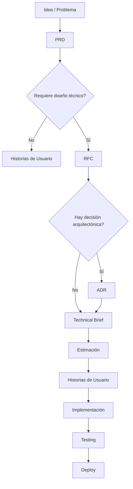

# Architect Journey

Framework de documentación para apoyar la toma de decisiones arquitectónicas, alineación de equipos y adopción de herramientas de Inteligencia Artificial en proyectos de software.

---

## Objetivo

Este repositorio proporciona templates, ejemplos y guías para documentar decisiones técnicas y de negocio de forma estructurada.

Los documentos generados pueden ser utilizados por:

- Arquitectos de Software
- Tech Leads
- Engineering Managers
- Product Managers
- Analistas
- Desarrolladores
- Equipos de IA Generativa

---

## Beneficios

- Alinear equipos humanos.
- Reducir ambigüedad.
- Mejorar estimaciones.
- Servir como contexto estructurado para asistentes de IA.

## Alcance

Este repositorio se enfoca en la definición y documentación de decisiones de producto, arquitectura y desarrollo.

La automatización de estos documentos mediante Inteligencia Artificial se encuentra fuera del alcance de este repositorio y será abordada en proyectos complementarios.

---

## Flujo de Documentación

## Roles y Responsabilidades

| Documento            | Responsables Principales         | Participantes                                |
| -------------------- | -------------------------------- | -------------------------------------------- |
| PRD                  | Product Manager, Product Analyst | Engineering Manager, Stakeholders, Tech Lead |
| RFC                  | Tech Lead, Arquitecto            | Backend, Frontend, QA, Engineering Manager   |
| ADR                  | Arquitecto, Tech Lead            | Especialistas Técnicos                       |
| Technical Brief      | Backend, Frontend, QA            | Tech Lead                                    |
| Estimación           | Equipo de Desarrollo             | QA, Tech Lead                                |
| Historias de Usuario | Product Analyst                  | Equipo Técnico                               |
| Testing              | QA                               | Backend, Frontend                            |
| Deploy               | Dev Team                         | Tech Lead, DevOps                            |

> No todos los cambios requieren todos los documentos. El objetivo es generar únicamente la documentación necesaria para reducir incertidumbre, facilitar la toma de decisiones y mejorar la colaboración entre equipos humanos e Inteligencia Artificial.

