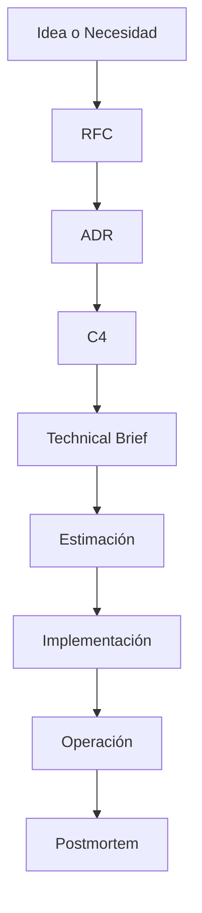
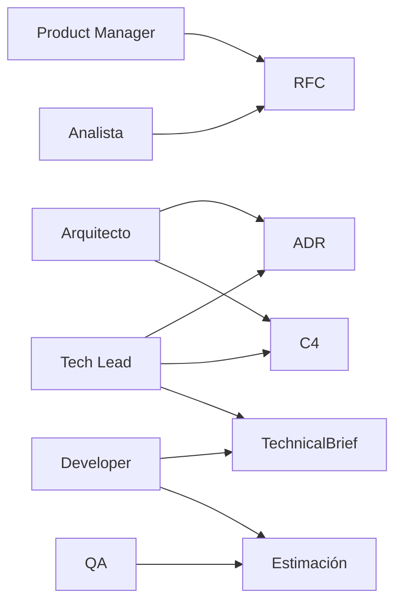

# Architect Journey

Framework de documentación para apoyar la toma de decisiones arquitectónicas, alineación de equipos y adopción de herramientas de Inteligencia Artificial en proyectos de software.

---

## Objetivo

Este repositorio proporciona templates, ejemplos y guías para documentar decisiones técnicas y de negocio de forma estructurada.

Los documentos generados pueden ser utilizados por:

- Arquitectos de Software
- Tech Leads
- Engineering Managers
- Product Managers
- Analistas
- Desarrolladores
- Equipos de IA Generativa

---

## Beneficios

- Mejor entendimiento del contexto
- Estimaciones más precisas
- Menor dependencia de conocimiento tribal
- Mejor onboarding
- Base documental para IA
- Trazabilidad de decisiones

---

## Flujo de Documentación

## Roles Participantes

